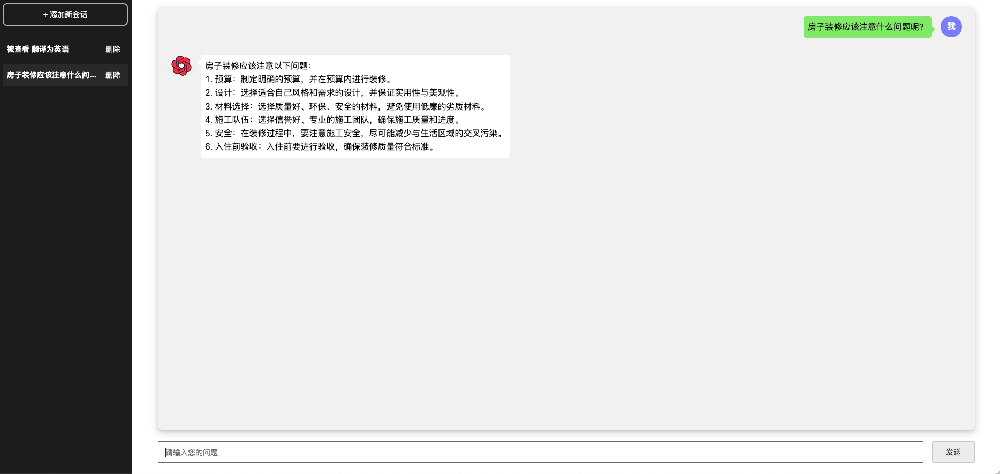

# 一个 AI 助手

这是一个 AI 项目，集成各种开放 AI 的能力。

## 项目介绍



1. 目前仅仅接入了 chatgpt api，后面打算接入其他 ai，比如国产 ai。
2. 前端使用 umijs, react, ts; 后端使用 koa，ts，后端也是用 ES module 方式去写

## node 版本

需要 node >= 18 版本

## 必要文件

在`src/consts/`下面新建 `key.mjs`, 提供如下字段用于调用 openAI api，例如如下方式：

```
// openAi key
export const OPENAI_API_KEY = 'xxxx';
// 调用 https://api.openai.com/dashboard/billing/credit_grants 接口headers中需要传递的参数 authorization
export const ACCOUNT_AUTHORIZATION = 'xxx';
// 调用 https://api.openai.com/dashboard/billing/credit_grants 接口headers中需要传递的参数 openaiOrganization
export const ACCOUNT_ORGANIZATION = 'xxx';

```

> 如果你暂时没有上述字段, 可以给我发个邮件(737649321@qq.com)，我很乐意为你提供帮助.

## 如何使用？

1. 首先安装依赖，`根目录`下安装依赖，使用`pnpm`安装代码。
2. 启动项目：根目录下执行`npm run dev:backend`，启动后端项目。
3. 访问项目地址：`http://localhost:3000`

## 如何开发？

### 方式一：一键启动

`npm run start:dev` Or `npm run start:debug`

### 方式二：分前后端启动

1. 首先安装依赖，`根目录`下和`/frontend/`目录下都要安装依赖，使用`pnpm`安装代码。
2. 构建前端产物：`frontend/`目录下，执行`npm run dev`, 启动前端项目。
3. 启动后端：根目录下执行`npm run dev:backend`，启动后端项目; 如果需要调试后端，请执行`npm run debug:backend`。
4. 访问前端项目地址：`http://localhost:8000`

### 如何修改端口

1. 默认前端端口是`8000`, 后端端口是`3000`
2. 修改前端端口，修改`/frontend/.env`下的端口配置
3. 修改后端端口，修改`/src/server.mjs`下的`SERVER_PORT`字段，如果前端需要和后端联调，还需修改`/frontend/.env`的代理配置

## TODO

- [x] stream 输出
- [x] 获取账户信息
- [x] 支持切换到 gpt-4
- [ ] monorepo 探索
- [ ] chrome 扩展
- [ ] i18n
